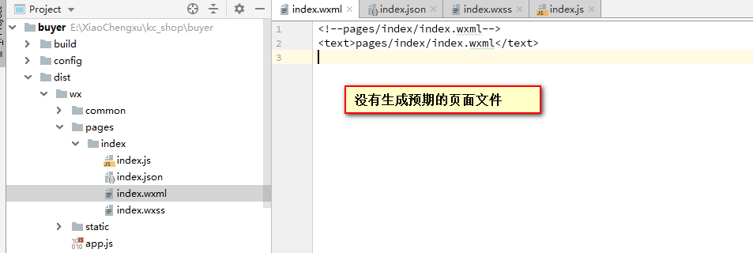
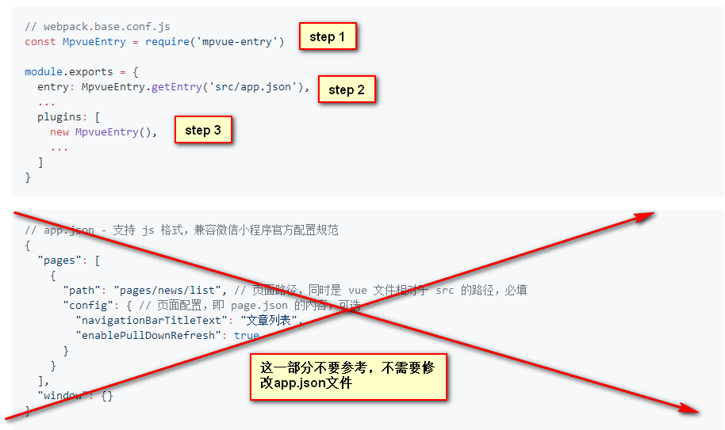
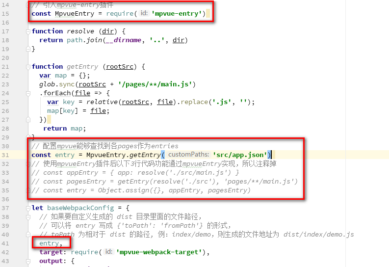
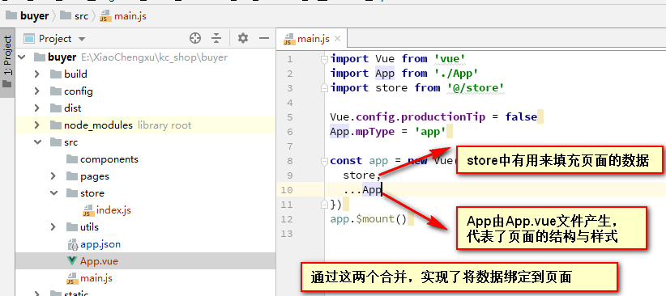
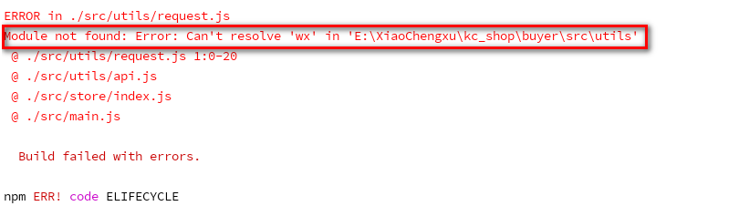
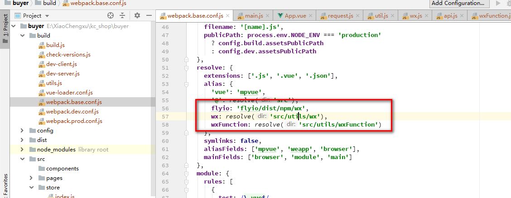
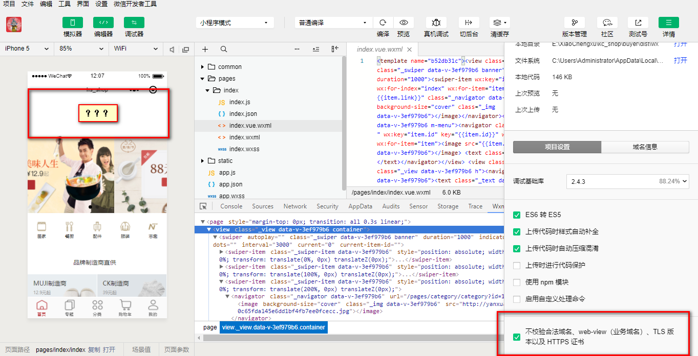
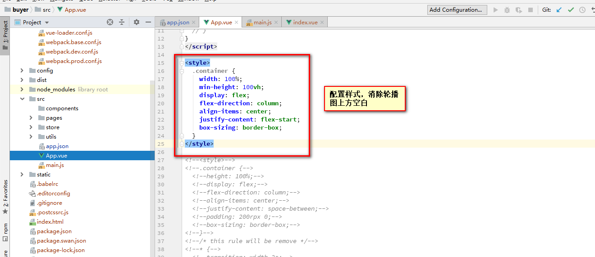

# mpvue小程序-項目初始化-首頁基本功能
Created 星期一 31 十二月 2018

1. 根据mpvue QuickStart文档要求，全局安装vue-cli工具，创建一个mpvue初始项目。创建过程中按照要求输入appid等项目基本信息，启用vuex（后面要用），禁用eslint（避免后续因为语法检查报错，打乱思路）。
2. 切换到新建项目所在目录下，运行npm install命令安装依赖，npm run build将mpvue源码编译为标准小程序项目。小程序项目生成目录为dist/wx。（新版mpvue好像支持了什么swan百度小程序，所以为了区分将微信小程序生成到了wx目录中）。
3. 删除新建项目中src/pages, src/components, src/utils目录下的所有默认文件。将src/main.js文件中export default{ config: {...}}中部分内容copy到新项目中src/app.json文件中（这是不同版本mpvue引起的差异，新版本的mpvue将app.json相关配置独立出来，保持与微信小程序标准要求一致，而不是像老版本一样需要写到main.js中）。由于本次只需要实现首页部分功能，所以仅copy与index相关的内容。对于出现在app.json中tabbar部分，而本次尚未实现的页面，使用pages/index/index进行占位。
4. 将app.json文件中引用到的所有pages、静态文件等copy到新项目。
5. 尝试重新运行npm run build，发现生成的小程序页面文件dist/wx/pages/index.wxml等仅包含如下内容，并没有如预期根据项目中的mpvue源码正确生成页面，需要继续配置。

6. 由于参考项目中pages没有使用mpvue要求的xx.vue+main.js写法，而是使用了mpvue-entry插件省略了每个页面配套的main.js文件。所以为了使页面能够正常编译，我们需要配置mpvue-entry插件。（参考1：<https://www.npmjs.com/package/mpvue-entry?activeTab=readme> 参考2：<https://github.com/F-loat/mpvue-entry> ）
	a. 在package.json中增加对mpvue-entry插件的依赖（"mpvue-entry": "^2.0.0-rc.8"，要用2.0.0版本的mpvue-entry插件，不要照抄参考项目的依赖，会报错！！），执行npm install命令安装该依赖。
	b. [参考https://github.com/F-loat/mpvue-entry](#参考https:github.comF-loatmpvue-entry) 和 <https://www.npmjs.com/package/mpvue-entry?activeTab=readme> 对mpvue-entry插件进行配置。
	c. 
	d. mpvue-entry插件配置总结：mpvue-entry插件一定要使用"^2.0.0-rc.8"版本，旧版本多有不兼容。不需要再新建一个routes.js文件，直接从app.json文件可以解析到entries。网上文档有很多错误，参考时候一定要多思考。
	e. 至此，重新运行npm run build命令，mpvue项目中页面已经可以成功编译为标准小程序页面，只是运行过程中还有很多报错：
	f. 
7. 让我们重新回到pages/index/index.vue，页面文件中多处出现的banner、channel、brands、newGoods等变量的绑定通过vuex插件实现。vuex参考：<https://www.jianshu.com/p/a804606ad8e9> 所以接下来需要配置vuex插件。
	a. 初始化项目时已经选择启用vuex，此处不用再修改package.json
	b. 从旧项目复制src/store文件夹及文件夹中文件到新项目对应路径
	c. 将src/store/index.js文件依赖或者间接依赖的src/utils/api.js request.js wx.js等copy到新项目（将整个src/utils文件夹copy过来）
	d. 将request.js依赖的flyio（用来发送http请求的库，功能相当于axios库）添加到package.json，重新npm install
	e. 修改src/main.js文件如下（使用store/index.js文件中导出的对象对默认的App对象进行扩充，请自行了解ES6的...操作符）：
	f. 
	g. 重新执行npm run build，报如下错误：
	h. 
	i. 在项目webpack.base.conf.js配置文件中增加如下内容：
	j. 
	k. 重新执行npm run build命令，启动server项目，在微信小程序开发工具中设置允许访问非https后台，刷新小程序，可以看到小程序商城首页（但是首页轮播图上方多了一片空白区域）：
	l. 
8. 复制参考项目src/App.vue文件中style标签内所有内容覆盖新项目style标签，即可解决轮播图上方空白区域问题。至此小程序项目初始化及首页实现完成。
9. 
10. **需要补充了解的知识：**mpvue与vue的异同、vuex功能及原理、webpack打包工具原理、mpvue-entry插件功能及原理。更新后的项目代码及本文档已同步至github，请自行参考。

